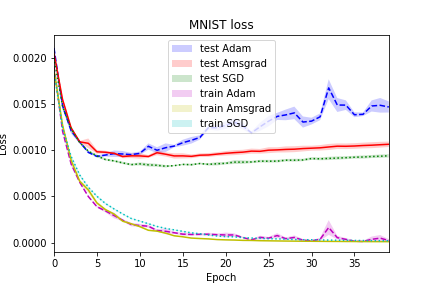

# Validating optimizers; ADAM versus AmsGrad

With the popularity of Machine and Deep learning, the number of optimization algorithms keep increasing. However, we should question their reliability and limits before using them. Our aim in this work is to present the comparison of the performance of some of these. More specifically, we compared the initial ADAM optimizer with the AMSGRAD. SGD is also presented as reference. The MNIST dataset was used on two popular architectures.

### Repository description
The main code can be run through [run.py](https://github.com/schreven/ADAM-vs-AmsGrad.git/src/run.py). It takes one argument that determines which code to run / figures to generate.

This work resulted in the report [ADAMvsAmsGrad.pdf](https://github.com/schreven/ADAM-vs-AmsGrad.git/ADAMvsAmsGrad.pdf).

As the code can take a long time to run, the generated data is saved in the 'data' folder and the figures are saved in 'arrays and images'. Many figures are not included in the report.

### Contributors
- Cem Musluoglu
- Milica Novakovic
- Cyril van Schreven
